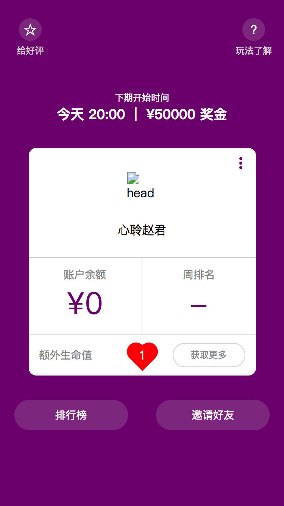
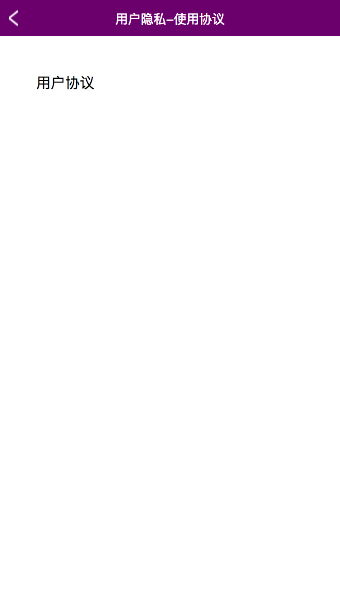

### 当前 Koala-UI 0.0.15

#### 使用手机 Chrome 打开，菜单选择创建桌面，即可体验 App 模式（可无网络使用，如飞行模式）

> 因为 icons 关键词与 HBuilder 打包冲突, 所以添加到手机桌面会没有 icons, 如果需要, 请替换 manifest.json 与 manifest.pwa.json (或替换 icons 即可)
> Android 需要 Chrome 浏览器, iOS 请使用 Safari

1. npm install 安装依赖（单纯预览可以省略此步）

2. npm run start 启动

